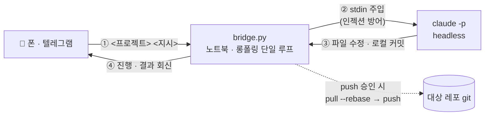

# claude_bridge

**폰에서 보낸 한 줄로 노트북의 Claude Code 를 원격 실행하는 ChatOps 브리지.**
PC 앞에 없어도 텔레그램에 `<프로젝트> <지시>` 를 보내면 상시 켜 둔 노트북이 대신
작업하고, 커밋은 `push` 로 승인했을 때만 원격에 올린다.


-success)

<!-- 스크린샷: (추후) — 현재는 아래 아키텍처 다이어그램으로 대체 -->

## 아키텍처



수신은 **롱폴링**이라 공개 서버·포트포워딩이 필요 없고, 단일 루프가 메시지를
**직렬 처리**한다(작업 중 도착분은 텔레그램에 보존됐다 순차 처리 — 큐·락 불필요).

## Quick Start

```bash
git clone <repo> && cd claude_bridge
cp .env.example .env          # TG_BOT_TOKEN · TG_ALLOWED_CHAT_IDS 채우기
python bridge.py              # 또는 run.bat — 폰에서 /help 로 시작
```

봇 토큰은 텔레그램 [@BotFather](https://t.me/BotFather) 의 `/newbot` 으로 발급받고,
chat ID 는 봇에 아무 메시지나 보낸 뒤 `getUpdates` 응답의 `message.chat.id` 로 확인한다.

## 주요 기능

| 기능 | 설명 |
|---|---|
| **원격 작업 실행** | `<프로젝트> <지시>` → 해당 폴더에서 headless claude 가 작업 후 결과 회신 |
| **실시간 진행 표시** | 작업 중 메시지 하나가 `📖 읽음 · ✏️ 수정 · ⚡ 실행` 으로 라이브 갱신(stream-json) |
| **인라인 버튼** | 프로젝트 선택·`push` 확인·점검 시작을 탭 버튼으로 — 타이핑 불필요 |
| **승인형 push** | 로컬 커밋까지만 자동, 원격 반영은 `push` 답장(또는 `✅ Push` 버튼)으로 명시 승인 |
| **예약 점검 알림** | 지정 요일·시각에 브리지가 먼저 알림 → `✅확인시작` 탭 시 **읽기 전용** 점검 실행 |
| **사진 대조** | 증권 캡처를 보내면 로컬 REST 값과 대조해 일치/불일치 판정(멀티모달 수신) |

## Why — 왜 만들었나

**문제**: 외출 중 노트북 앞에 없을 때도 "이 버그 고쳐줘" 한 줄을 처리하고 싶다.
그런데 노트북은 방화벽 뒤 개인 기기라 공개 엔드포인트가 없고, 원격 코드 실행·커밋은
그 자체로 위험한 표면이다.

**해결**: 봇 프레임워크·클라우드 서버 없이 **표준 라이브러리만**으로 롱폴링 브리지를
직접 설계했다. 아웃바운드 롱폴링이라 호스팅이 불필요하고, 원격 실행 표면은 신원 게이트·
인젝션 방어·최소 권한으로 다층 방어한다. 개인 원격 도구에 맞춰 **운영 표면을 최소화**하는
것이 최우선 가치다.

## 보안 설계 (기술적 트레이드오프)

원격에서 코드를 실행·커밋하는 표면이라 방어를 다층으로 둔다.

| 경계 | 방어 | 트레이드오프 |
|---|---|---|
| **신원 게이트** | chat ID 허용목록 필수 — 목록 밖 메시지는 무회신·로그만. 빈 목록이면 기동 거부. 그룹 ID 금지(비허용 멤버의 버튼 탭 차단) | 봇은 공개 검색될 수 있음 → 허용목록이 유일 방벽 |
| **명령 인젝션(RCE)** | 사용자 입력을 argv 에 **절대 두지 않고 stdin 으로만** claude 에 전달 | Windows `claude.CMD` shim 의 `cmd.exe` 재파싱을 이스케이프로는 못 막아 stdin 전용으로 원천 차단 |
| **최소 권한** | 경로별 `--allowedTools` 3티어 — 작업(편집+git)·점검(읽기+검증)·사진(읽기만). 일반 셸·`git push`·네트워크 미부여 | 사진 속 악성 텍스트가 커밋으로 상승하는 confused-deputy 차단 |
| **비밀값** | 봇 토큰·chat ID 는 `.env` 로만(커밋 금지). 회신·로그에서 토큰·내부 경로 마스킹 | — |
| **푸시 통제** | 로컬 커밋까지만 자동, 원격 반영은 사용자 `push` 승인 시 `pull --rebase` 후 | claude 에는 push 권한 없음 |
| **단일 인스턴스** | pidfile 락 — 같은 봇을 두 곳에서 폴링하면 텔레그램 409 | 브리지는 한 대에서만 실행 |

## 환경 변수 (`.env`)

`.env.example` 을 복사해 채운다. **실제 토큰·chat ID 는 커밋 금지** — 아래는 이름·형식만.

| 변수 | 필수 | 형식 | 설명 |
|---|---|---|---|
| `TG_BOT_TOKEN` | ✅ | `<숫자>:<영숫자>` 형태 토큰 | BotFather 발급 봇 토큰 |
| `TG_ALLOWED_CHAT_IDS` | ✅ | 정수 chat ID, 콤마 구분(개인 채팅만) | 허용목록 — 빈 값이면 기동 거부 |
| `CLAUDE_TIMEOUT_SEC` | ⬜ | 정수(초, 기본 900) | claude 작업 1건 최대 실행 시간 |
| `TARGET_ROOT` | ⬜ | 레포 루트 기준 상대경로 | 원격 지시 대상 루트(직속 폴더만) |

## 명령

| 입력 | 동작 |
|---|---|
| `<프로젝트명> <작업 지시>` | 해당 프로젝트에서 claude 실행 후 결과 회신 (예: `trading_info README 오타 고쳐줘`) |
| `/projects` | 원격 지시 가능한 대상 프로젝트 목록(탭 버튼) |
| `push` | 로컬 커밋을 원격 main 에 반영(`pull --rebase` 후, 충돌 시 중단). `✅ Push` 버튼으로도 가능 |
| `/help` | 도움말 |

> 프로젝트명을 못 알아듣거나 형식이 안 맞으면 대상 프로젝트가 **탭 버튼**으로 뜬다.
> 버튼 탭도 chat ID 허용목록으로 통제된다.

### 노트북 상시 운영

브리지는 노트북 프로세스라 **켜 두는 동안만** 폰 원격이 동작한다.

- **절전 해제**(필수) — 전원 옵션에서 "절전: 안 함", "덮개 닫을 때: 아무 동작 안 함". 잠자면 롱폴링이 멈춘다.
- **자동 시작**(선택) — 부팅 시 실행하려면 `run.bat` 바로가기를 시작프로그램 폴더(`Win+R` → `shell:startup`)에 넣는다.

## 개발

```bash
python -m pytest tests/              # 단위 테스트(순수 함수 다수 고정)
ruff check . && ruff format --check .
python -m mypy --strict bridge.py
python bridge.py --selftest          # 순수 함수 스모크(보안 경계 포함)
```

전 로직이 단일 파일 `bridge.py` 에 있다(롱폴링 루프 · 파싱 · 프로젝트 해석 · claude 러너 ·
git 오케스트레이션). 파싱·허용목록·경로 해석·마스킹 등 순수 함수는 분리돼 테스트로 고정된다.
